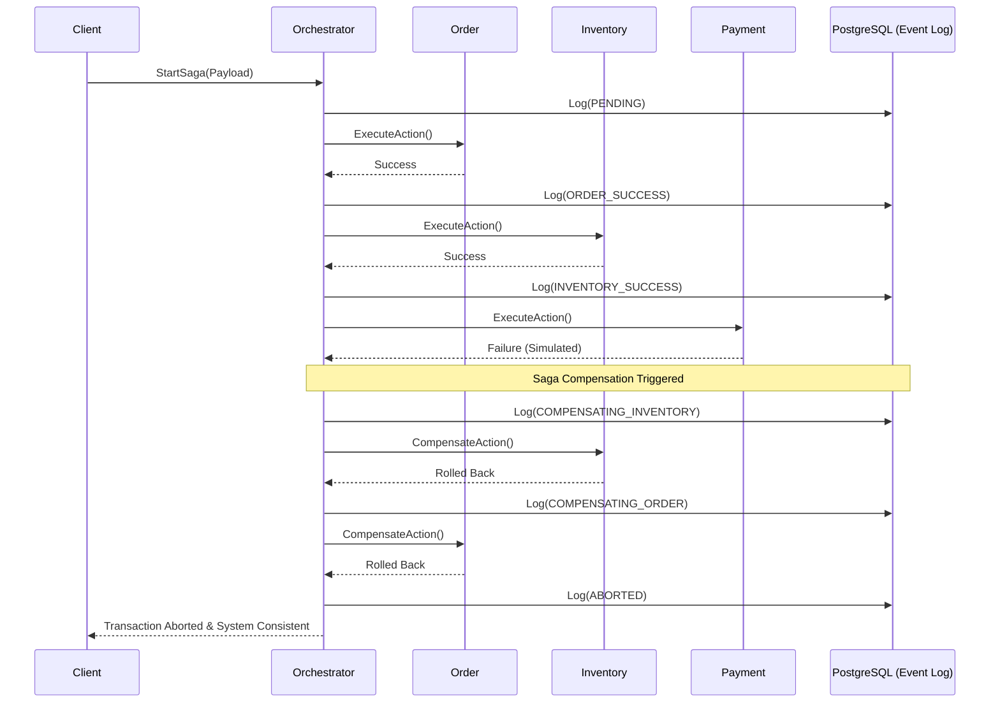

# High-Performance Saga Orchestrator (C++20)

A distributed microservices orchestrator implementing the **Saga Design Pattern** to guarantee eventual consistency across multiple independent services. Built entirely in modern C++20, this system leverages gRPC HTTP/2 multiplexing and asynchronous PostgreSQL event sourcing to deliver enterprise-grade throughput with a microscopic resource footprint.

## 🚀 Performance & Benchmarks

Engineered for high-frequency trading and low-latency environments, the system was stress-tested using a 50-thread concurrent worker pool executing 10,000 asynchronous distributed transactions.

*   **Throughput:** Peak processing speed of **525+ Transactions Per Second (TPS)**.
*   **Resource Efficiency:** Worker nodes (Order, Inventory, Payment) operate on **<25 MB RAM** under peak load—a 90% reduction compared to standard JVM/V8 orchestration.
*   **Compute Scaling:** Asynchronous batching infrastructure scales seamlessly across cores, cleanly utilizing **850%+ CPU** during 10k-request load floods.
*   **Fault Tolerance:** Maintained a **100% success rate** for state transitions and automated rollbacks with zero data loss or dropped RPCs during simulated service outages.

## 🏗️ Architecture & State Machine

The orchestrator guarantees ACID-compliant event sourcing by logging JSONB state transitions to PostgreSQL. If a downstream service fails, the orchestrator automatically fires compensation transactions (undo operations) to upstream services in reverse order.



## 🛠️ Tech Stack

*   **Language:** C++20 (POSIX-compliant multithreading, `std::condition_variable`, `std::atomic`)
*   **RPC Framework:** gRPC & Protocol Buffers (Protobuf)
*   **Database:** PostgreSQL 15 (Native event logging via `libpqxx`)
*   **Infrastructure:** Docker, Docker Compose, multi-stage Alpine/Debian builds
*   **Build System:** CMake, vcpkg

## ⚙️ Key Technical Implementations

1.  **Asynchronous Producer-Consumer Batching:** Replaced synchronous, mutex-blocked database inserts with an in-memory queue and a background flush-worker. This eliminated I/O disk bottlenecks and increased TPS by nearly 11x.
2.  **Containerized Network Mesh:** Configured isolated Docker DNS routing, allowing C++ microservices to resolve dependencies natively without hardcoded IPs.
3.  **JSONB Event Sourcing:** Leveraged PostgreSQL's binary JSON format (`::jsonb`) to store dynamic transaction payloads, enabling high-speed querying of complex distributed states.

## 🚦 Getting Started

### Prerequisites
*   Docker & Docker Compose
*   CMake & a C++20 compliant compiler (for building the local test client)

### 1. Boot the Microservice Fleet
Spin up the Orchestrator, PostgreSQL database, and all three worker services using the pre-configured Compose file:

```bash
cd infra
docker compose up -d --build
```

### 2. Run the Load Test
Compile and run the synthetic load generator to fire concurrent transactions at the Dockerized cluster:

```bash
cd build
cmake --build . --config Release
./test_client
```

### 3. Monitor Real-Time Footprint
Watch the ultra-low memory consumption in real-time as the C++ binaries process the queue:

```bash
docker stats
```

## 👨‍💻 Author
**Shaik Asim Shareef, CSE, IIT Kharagpur** - *GitHub : https://github.com/AsimShareef*
